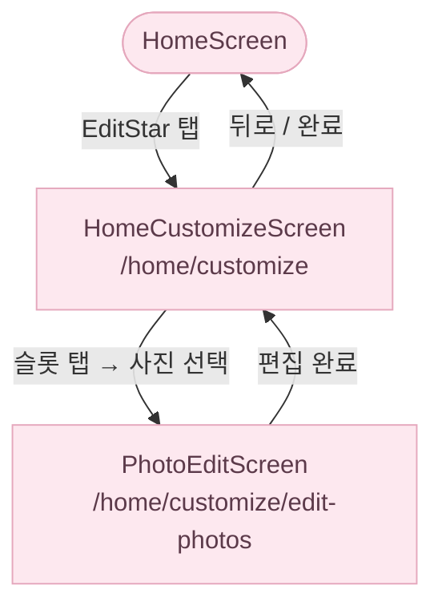
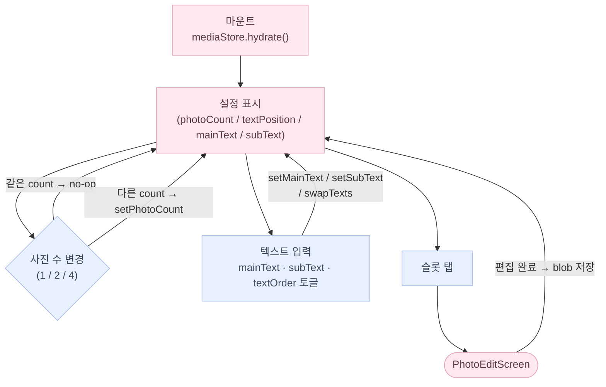
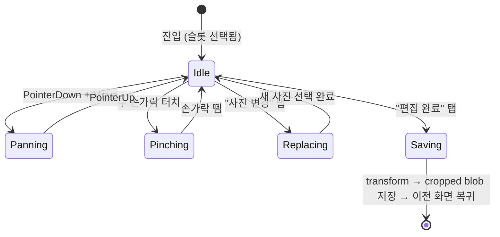
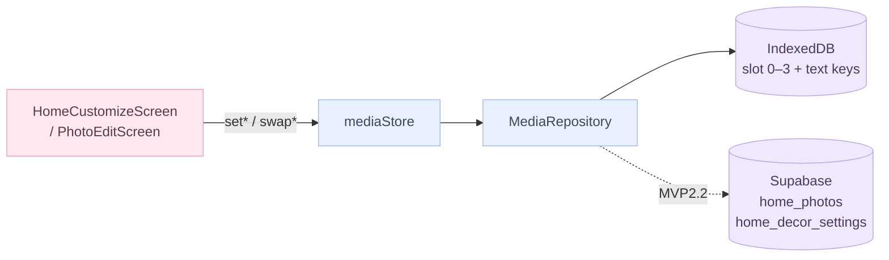

# 홈 커스터마이즈 플로우

> 위치: `src/app/(fullscreen)/home/customize/`, `src/components/home-customize/`

AppShell·탭바 없는 `(fullscreen)` 라우트 그룹에 속합니다.
진입: HomeHero 우상단 EditStar 아이콘 → `/home/customize`.

---

## 화면 구조

---

## HomeCustomizeScreen 상태

---

## PhotoEditScreen 상태

---

## 데이터 흐름

`setPhotoCount` 가드: 같은 count 면 no-op, 다른 count 로 변경해도 기존 슬롯 사진은 보존.

---

## domain/home/decor 상수

| 상수 | 값 |
|------|----|
| `PhotoCount` | `1 \| 2 \| 4` |
| `PhotoSlot` | `0 \| 1 \| 2 \| 3` |
| `TextPosition` | `topLeft \| topRight \| bottomLeft \| bottomRight` |
| `TextOrder` | `mainFirst \| subFirst` |
| `MAIN_TEXT_MAX` | 40자 |
| `SUB_TEXT_MAX` | 20자 |

---

## IndexedDB 마이그레이션 이력

| 버전 | 내용 |
|------|------|
| v1 | 초기 schema |
| v2 | `mediaHomeOverlays` 삭제 (스티커 기능 제거) |
| v3 | `mediaHomeHero` blob → slot 0 이주, `mediaPhotoCount = 1` 설정 |
| v4 | `mediaTextPosition` / `mediaMainText` / `mediaSubText` / `mediaTextOrder` 키 추가 (데이터 이주 없음) |

---

## 관련 파일·문서

- `src/domain/home/decor.ts` — 타입·상수 원천
- `src/store/mediaStore.ts` — hydrate / setPhoto / setMainText / swapTexts
- `src/data/repositories/MediaRepository.ts` — Repository 인터페이스
- `docs/architecture/data-layer.md` — 어댑터 패턴 상세
- `docs/flows/home.md` — HomeHero 에서 customize 진입 맥락
